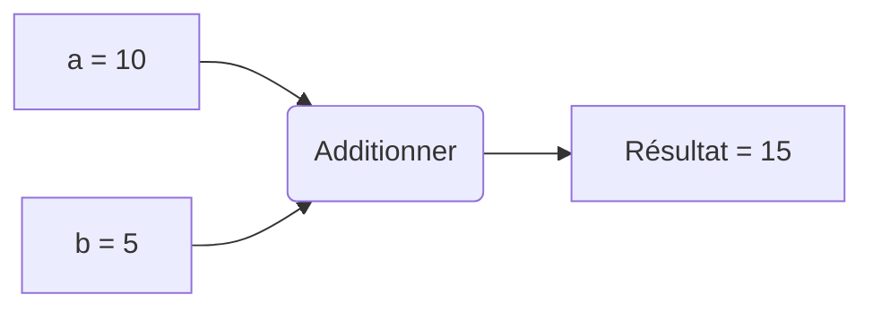

# Python 3 Formation 1


# 1 - Fonctions
Assez vite, il devient indispensable de rendre notre code plus lisible, pour cela on découpe notre programme en "blocs" logiques, on utilise donc les fonctions.

## Définition
Une fonction possède :
- Un nom unique
- Une suite de paramètres (pas obligatoire)
- Une valeur de sortie (pas obligatoire)

## Logique
La fonction additionner prend 2 variables en paramètres (a et b) et retourne un résultat (15).

## Déclaration
Une fonction démarre par le mot clé **def**
On indique un retour avec le mot clé **return**
```python
def <nom_fonction> (<param_1>, <param_2>):
  # Votre code
  return <param_1> + <param_2>
>>> def additionner(a, b):
...  return a + b
...
>>> additionner(10, 5)
15
```
### Exemple
Prenons le cas d'un script qui demande à l'utilisateur de répondre par `yes` ou par `no`
Sans les fonctions, le code peut ressembler à ça :
```python
print("Script de configuration du serveur")  
  
reponse = ""  
while reponse != 'yes' and reponse != 'no':  
    reponse = input("Voulez vous continuer ? (yes|no) : ")  
  
if reponse == 'yes':  
    print("Vous voulez continuer")  
else:  
    print("Vous souhaitez quitter")
``` 
Niveau lisibilité c'est acceptable, car notre code est simple, voyons avec une fonction
```python
# Définition de la fonction
def ask_yes_no ():  
  reponse = ""  
  while reponse != 'yes' and reponse != 'no':  
        reponse = input("Voulez vous continuer ? (yes|no) : ")
  return reponse == 'yes'  
# Appel quelque part dans notre code 
print("Script de configuration du serveur")  
if ask_yes_no():  
    print("Vous voulez continuer")  
else:  
    print("Vous souhaiter quitter")
```
À l'aide d'une fonction, notre logique est passée de 8 instructions à 5 et on gagne en visibilité.
## Avantages
L'un des principaux avantages des fonctions est que nous n'avons pas besoin de savoir ce qu'il se passe à l'intérieur d'une fonction pour l'utilisateur, il suffit juste de savoir l'utiliser.
Reprenons l'exemple de la question `Voulez vous continuer ? (yes|no)`
Si on souhaite que la question soit proposée à l'aide d'une boite de dialogue, il suffit de modifier le code à l'intérieur de `ask_yes_no()` sans toucher à notre logique
```python
def ask_yes_no ():  
    import tkinter  
    from tkinter import messagebox  
  
    return messagebox.askokcancel("Titre", "Voulez vous continuer ?")  
# On n'a pas modifié la suite de notre code
print("Script de configuration du serveur")  
if ask_yes_no():  
    print("Vous voulez continuer")  
else:  
    print("Vous souhaitez quitter")
```
## Paramètres par défaut
Il est possible de spécifier une valeur par défaut à un ou plusieurs arguments dans une fonction
Exemple:
```python
>>> def fonction_test(prefix, nom="World"):
...  print(prefix + " " + nom)
...
>>> fonction_test("Hello")
Hello World
>>> fonction_test("Hello", "you")
Hello you
>>>
```
La partie intéressante est `nom="Word"`, nous définissons la valeur de `nom` à `World` par défaut

### Contrainte
Une fois que l'on définit un argument avec une valeur par défaut, la suite des arguments doit posséder une valeur par défaut
Exemple qui ne fonctionne pas:
```python
>>> def fonction(prefix, separator=" ", message):
...  print(prefix + seperator + message)
...
  File "<stdin>", line 1
SyntaxError: non-default argument follows default argument
>>>
```
Exemple qui fonctionne : 
```python
>>> def fonction_test(prefix, separator=" ", message="World"):
...  print(prefix + separator + message)
...
>>> fonction_test("Hello", " ", "You")
Hello You
```
### Spécifier un paramètre
Il est possible de spécifier la valeur d'un paramètre lors de l'appel à une fonction
Exemple :
```python
>>> def fonction_test(prefix, separator=" ", message="World", suffix="."):
...  print(prefix + separator + message + suffix)
...
>>> fonction_test("Hello", message="World", "")
  File "<stdin>", line 1
SyntaxError: positional argument follows keyword argument
>>> fonction_test("Hello", message="World")
Hello World.
>>> fonction_test("Hello", message="World", suffix="!")
Hello World!
>>>
```
Comme pour les paramètres par défaut, une fois qu'on a commencé à spécifier une valeur, il faut continuer.

## Ordre d'appel
Il est possible et fréquent d'utiliser des fonctions en paramètre d'autres fonctions
 Exemple:
 ```python
>>> def add(a, b):
...  result = a + b
...  print('{0} + {1} = {2}'.format(a, b, result))
...  return result
...
>>> def sub(a, b):
...  result = a - b
...  print('{0} - {1} = {2}'.format(a, b, result))
...  return result
...
>>> resultat = sub(add(3, 10), 5)
3 + 10 = 13
13 - 5 = 8
>>> resultat
8
 ```
La valeur de sortie de `add` sera calculée avant d'exécuter `sub`.

# 2 - Exceptions
Les exceptions nous permettent d'intercepter des erreurs dans notre code.
C'est très pratique, car de base, si Python rencontre une erreur, il arrêtera l’exécution de notre programme.
Exemple :
```python
>>> def fonction_test ():
...  maListe = [1, 2, 3, 4, 5]
...  print(maListe[5])
...  print("Fonction OK")
...
>>> fonction_test()
Traceback (most recent call last):
  File "<stdin>", line 1, in <module>
  File "<stdin>", line 3, in fonction_test
IndexError: list index out of range
```
Si nous essayons d’accéder au 6e élément d'une liste de 5 éléments, Python lance une erreur et arrête notre programme au lieu de nous afficher `Fonction OK`.<br>
> La liste des exceptions fournies par Python est disponible à l'adresse suivante : https://docs.python.org/3/library/exceptions.html

## Usage
Une exception est composée d'au moins 2 blocs d'instructions :
 - Les instructions pouvant potentiellement poser un problème
 - Les instructions à exécuter si une erreur survient 
Les mots clés sont **try** et **except**
```python
try:
  # Code problématique
except <type_exception>:
  # Code en cas d'erreur
```
Reprenons l'exemple de notre fonction `fonction_test`
```python
>>> def fonction_test ():
...  maListe = [1, 2, 3, 4, 5]
...  try:
...   print(maListe[5])                   # Erreur, indice trop grand
...  except IndexError:                   # On intercepte les erreurs de type IndexError
...   print("Une erreur dans l'indice")   # On affiche une message d'erreur personnalisé
...  print("Fonction OK")
...
>>> fonction_test()
Une erreur dans l'indice
Fonction OK                               # La fonction va jusqu'au bout
```

### Finally
Il est possible d'avoir plus de contrôle sur nos exceptions à l'aide du mot clé **finally** qui permet d’exécuter des instructions, qu'il y ait eu erreur ou non.
Exemple:
```python
>>> def fonction_test ():
...  print("Ouverture de la base de données")
...  try:
...   print("Récupération d'un élément")
...   raise IndexError("ID introuvable")        # On jette une exception
...  except IndexError:
...   print("Erreur lors de la récupération de l'élément...")
...   return -1                                 # On retourne -1 indiquant une erreur
...  finally:
...   print("Fermeture de la base de données")   # Via finally le code est quand même exécuté
...
>>> resultat = fonction_test()
Ouverture de la base de données
Récupération d'un élément
Erreur lors de la récupération de l'élément ...
Fermeture de la base de donnée
>>> resultat
-1
```

### Raise
Le mot clé **raise** nous permet de jeter une exception quand on considère qu'il y a une erreur, par exemple, si on attend un entier strictement positif et que l'utilisateur nous donne un entier négatif.
Exemple:
```python
>>> def fonction_test ():
...  valeur = int(input("Entrez un entier positif : "))
...  if valeur <= 0:
...   raise ValueError("Entier positif 0 < x < +inf")
...
>>> fonction_test()
Entrez un entier positif : -1
Traceback (most recent call last):
  File "<stdin>", line 1, in <module>
  File "<stdin>", line 4, in fonction_test
ValueError: Entier positif 0 < x < +inf
```

## Exceptions personnalisées
Il est possible de créer nos propres exceptions pour rendre nos erreurs plus claires.
Exemple d'une exception indiquant qu'un nombre négatif :
```python
class NegativeValueError(Exception):  
    def __init__(self, *args, **kwargs):  
        super().__init__(self, *args, **kwargs)  
  
  
def fonction_test ():  
    valeur = int(input("Entrez un entier positif : "))  
    if valeur <= 0:  
        raise NegativeValueError("Entier positif 0 < x < +inf")  
  
try:  
    fonction_test()  
except NegativeValueError:  
    print("Valeur négative")
```
> Nous verrons `class`, `*args` et `**kwargs` dans le chapitre dédié à l'objet

# 3 - Documentation
La documentation est la chose **la plus importante** lors de nos développements, c'est d'autant plus vrai en Python qui possède un langage dynamique.
Sinon comment savoir ce qu'attend ou retourne une fonction ?
D'un jour à l'autre on s'y retrouve, 6 mois plus tard c'est une autre histoire.
## Bonne pratique
Plus une fonction est documentée mieux c'est, il arrive souvent qu'une fonction contienne plus de documentation que de code.
Une documentation commence par `"""` et termine par `"""`
Exemple :
```python
def additionner(nombre1, nombre2):  
  """  
  Additionne le nombre 1 et le nombre 2  
  
  :exemple: 
  >>> additionner(1, 2.5)
  3.5  
  
  :param nombre1: Nombre 1  
  :type nombre1: int|float|complex
  
  :param nombre2:  
  :type nombre2: int|float|complex
   
  :return: nombre1 + nombre2  
  :rtype: int|float|complex  
  """
  return nombre1 + nombre2
```
Ainsi un autre développeur a juste à regarder la documentation pour pouvoir utiliser notre fonction.

## Structure
Une documentation d'une fonction est composée de :
 - Une explication
 - Un exemple quand c'est possible
 - La liste des paramètres et leurs types possibles
 - Ce que retourne la fonction et le(s) type(s) de sortie
```python
def <nom_fonction> (<param_1>, <param_2>, etc):
  """
  <description>
  
  :exemple:
  >>> <nom_fonction>(<param_1>, <param_2>)
  <sortie>
  
  :param <param_1>: Description
  :type <param_1> : Types possible
  
  :param <param_2>: Description
  :type <param_2> : Types possible
  :return: <param_1> + <param_2>
  :rtype: Types possible
```
> J'insiste sur l'importance de la documentation.<br>
> Il est possible de créer des templates de documentation dans PyCharm.

# 4 - Bibliothèques
L'une des forces de Python est la quantité de bibliothèques disponibles, quand vous êtes face à un besoin, il est rare de ne pas trouver de solutions existantes.

## Bibliothèque standard
Python possède déjà un grand nombre d'outils présents dans la bibliothèque standard par exemple :
- Le traitement de fichiers
- Le traitement de données au format json
- Des outils mathématiques
- Etc ...
> https://docs.python.org/fr/3.6/library/index.html

### Utilisation d'une bibliothèque
Les mots clés pour l'utilisation d'une bibliothèque sont `from` et `import`

`import` permet d'ajouter des morceaux entier de bibliothèques dans notre code contrairement à `from` qui importe uniquement des morceaux précis.

Exemple d'un code utilisant `import` permettant d'avoir le chemin absolu d'un fichier présent dans le **même** dossier que le fichier Python exécuté :
```python
import os
current_directory = os.path.dirname(__file__)
file_name = 'test.txt'
file_path = os.path.join(current_directory, file_name)
print(file_path)
```
Ici on importe l'ensemble de la bibliothèque `os`, puis on appel les fonctions `dirname` et `join` présentes le module `path`

Le même code en utilisant `from` :
```python
from os.path import dirname, join
current_directory = dirname(__file__)
file_name = 'test.txt'
file_path = join(current_directory, file_name)
print(file_path)
```
Ici on importe uniquement les fonctions `dirname` et `join` présentes dans le module `path` de la bibliothèque `os`

Alors lequel choisir ? En fait cela dépend des cas et du développeur, personnellement dans un code de 300 lignes je trouve beaucoup plus lisible et compréhensible un `os.path.join` qu'un `join` ou je serais obligé d'aller vérifier la documentation pour être sûr qu'il s’agisse d'une composition de chemins.

Par contre, je trouve superflu d'utiliser `math.sqrt` au lieu de simplement `sqrt` (racine carrée)

## Bibliothèques supplémentaires : Pip
Pip est l'outil d'installation de bibliothèques de prédilection, de base il permet d’accéder aux bibliothèques présentes sur https://pypi.org/ (Python Package Index)

### Usage
Installer une bibliothèque :
```
pip install <nom_bibliothèque>
```
Connaitre l'ensemble des bibliothèques installées :
```
pip freeze
```
Installer des bibliothèques depuis un fichier `requirements.txt` :
```
pip install -r requirements.txt
```

# 5 - Fichiers
Dans un programme, il est fréquent de devoir manipuler des fichiers, que ce soit en tant que paramètres de configuration ou en tant que sortie.
Python nous permet de traiter les fichiers de manière très simple.

## CFG
 Exemple d'un fichier `sample.cfg` :
 ```
KEY1="VALUE1"  
KEY2="VALUE2"  
KEY3="VALUE3"  
KEY4="VALUE4", "VALUE5"
 ```

### Installation
Le plus simple est d'utiliser la bibliothèque `configobj` :
> Rappel : Il est préférable de créer / utiliser un environnement virtuel
```
pip install configobj
```

### Usage
Pour utiliser `configobj` il suffit de faire l'import correspondant et de fournir le chemin du fichier.
```python
from configobj import ConfigObj
config = ConfigObj(<path>)
```

### Lecture
Créons un fichier `test_cfg.py` se trouvant dans le même dossier que le fichier `sample.cfg`
```python
import os
from configobj import ConfigObj
# On récupère le chemin du dossier contenant le fichier
basedir = os.path.dirname(__file__)
# On crée le chemin vers notre fichier de configuration
path = os.path.join(basedir, 'sample.cfg')
# Lecture du fichier
config = ConfigObj(path)
print(config)
# Sortie
{'KEY1': 'VALUE1', 'KEY2': 'VALUE2', 'KEY3': 'VALUE3', 'KEY4': ['VALUE4', 'VALUE5']}
```
Comme on peut le voir, la bibliothèque `configobj` nous permet de lire très facilement les fichiers `.cfg` en nous retournant un dictionnaire

### Écriture
Écrire un fichier `.cfg` est aussi simple que de le lire, on importe la bibliothèque, on crée une configuration et on sauvegarde le résultat.
```python
import os
from configobj import ConfigObj
basedir = os.path.dirname(__file__)
path = os.path.join(basedir, 'test.cfg')
config = ConfigObj()
config.filename = path
config['CLE_1'] = "Bonjour"
config['CLE_2'] = "a"
config['CLE_3'] = "tous"
config.write()
print(config)
# sample.cfg après exécution de notre programme
CLE_1 = Bonjour  
CLE_2 = a  
CLE_3 = tous
```

### Multi niveau
Il est tout à fait possible d'agencer les données sur plusieurs niveaux exemple :
```python
import os
from configobj import ConfigObj
basedir = os.path.dirname(__file__)
path = os.path.join(basedir, 'test.cfg')
config = ConfigObj()
config.filename = path
config['CLE_1'] = "Bonjour"
config['CLE_2'] = "a"
config['CLE_3'] = "tous"
redis_config = {
    "host": "localhost",
    "port": 1883,
    "credentials": {
        "username": "toto",
        'password': "asticot"
    }
}
config['REDIS'] = redis_config
config.write()
print(config)
```
Ce qui donne le fichier de sortie suivant :
```
CLE_1 = Bonjour  
CLE_2 = a  
CLE_3 = tous  
[REDIS]  
host = localhost  
port = 1883  
[[credentials]]  
username = toto  
password = asticot
```

## JSON
Exemple d'un fichier `sample.json` :
```json
{  
  "colors": [  
    {  
      "color": "black",
      "category": "hue",
      "type": "primary",  
      "code": {  
        "rgba": [255,255,255,1],
        "hex": "#000"
      }  
    },  
    {  
      "color": "white",
      "category": "value",
      "code": {
        "rgba": [0,0,0,1],
        "hex": "#FFF"
      }  
    }  
  ]  
}
```
### Usage
Python contient déjà la bibliothèque nous permettant de lire et écrire des fichiers JSON
```python
import json
``` 
### Lecture
Créons un fichier `test_json.py` se trouvant dans le même dossier que le fichier `sample.json`.
Il suffit ensuite d'ouvrir le fichier `.json` à l'aide de la fonction `open`<br>
La lecture du fichier `.json` est faite à l'aide de la fonction `load`
```python
import os
import json
basedir = os.path.dirname(__file__)
path = os.path.join(basedir, 'sample.json')
with open(path) as json_file:
    config = json.load(json_file)
print(config)
```
> L'utilisation de with nous permet d'être sûr que notre fichier sera fermé à la fin du bloc d'instructions

### Écriture
Écrire un fichier `.json` est aussi simple que de le lire :
```python
import os
import json
basedir = os.path.dirname(__file__)
path = os.path.join(basedir, 'test.json')
config = {
    "host": "localhost",
    "port": 3030,
    "public": "../public/",
    "paginate": {
        "default": 10,
        "max": 50
    },
    "mongodb": "mongodb://localhost:27017/api"
}
with open(path, 'w') as json_file:
    json.dump(config, json_file, indent=4)
print(config)
```
On indique qu'on souhaite ouvrir le fichier en écriture à l'aide de `'w'` pour write<br>
On enregistre ensuite notre dictionnaire à l'aide de fonction `dump`

## INI
Exemple d'un fichier `sample.ini` :
```ini
[Apache]  
port=80  
timeout=60  
  
[Mqtt]  
port=1883  
timeout=30  
  
[MongoDb]  
port=27017  
timeout=45
``` 
 
 ### Usage
 Python contient déjà la bibliothèque nous permettant de lire et écrire des fichiers INI
```python
from configparser import ConfigParser
``` 
 
 ### Lecture
Créons un fichier `test_ini.py` dans le même dossier que le fichier `sample.ini`
On peut : 
- Récupérer la liste des sections du fichier
- Récupérer les options d'une section
- Récupérer la valeur d'une option
```python
import os
from configparser import ConfigParser
basedir = os.path.dirname(__file__)
path = os.path.join(basedir, 'sample.ini')
parser = ConfigParser()  # Création d'un parseur de .ini
parser.read(path)  # Lecture du fichier .ini
print(parser.sections())  # Lister les sections du fichier
apache_options = parser.options("Apache")  # Récupérer les options d'une section
print(apache_options)
apache_port = parser.get("Apache", "port")  # Récupérer une valeur dans une section
print(apache_port)
```

### Écriture
Écrire un fichier `.ini` est aussi simple que de le lire :
```python
import os
from configparser import ConfigParser
basedir = os.path.dirname(__file__)
path = os.path.join(basedir, 'test.ini')
parser = ConfigParser()
parser.add_section('TimeMachine')
parser.set('TimeMachine', 'Model', 'DMC-12')
parser.set('TimeMachine', 'Speed', '88')
with open(path, 'w') as ini_file:
    parser.write(ini_file)
```
Ce qui nous donne le fichier de sortie suivant :
```
[TimeMachine]  
model = DMC-12  
speed = 88
```

# 6 - Requests
Requests c'est la bibliothèque qui nous permet de travailler avec le HTTP de manière "naturelle" .
D'ailleurs la description parle d'elle même.
Requests: HTTP for Humans
http://docs.python-requests.org/en/master/
Elle nous permet d'utiliser les 5 verbes HTTP
 - GET
 - POST
 - PUT
 - PATCH
 - DELETE

## Installation
Il suffit juste de faire un pip install :
```
pip install requests
```
## Opérations HTTP
### Service de test
Un micro service REST est fourni afin d'illustrer l'ensemble des opérations HTTP.
https://github.com/averdier/py_sample_chat_service

### Opération : GET
Récupérer une information en HTTP à l'aide de `get` :
```python
>>> import requests
>>> reponse = requests.get('http://localhost:5555/api/messages')
>>> reponse
<Response [200]>
>>>
```
La sortie est un **objet**, nous aborderons cette notion lors de la prochaine formation, les choses à savoir pour le moment c'est qu'une réponse contient plusieurs informations :
 - Le code HTTP
 - Le texte de la réponse
 - Une version JSON si le format attendu est un JSON
```python
>>> import requests
>>> reponse = requests.get('http://localhost:5555/api/messages/')
>>> reponse
<Response [200]>
>>> print(reponse.status_code)
200
>>> print(reponse.text)
{
    "messages": []
}
>>> import json
>>> print(json.dumps(reponse.json(), indent=4))
{
    "messages": []
}
>>> reponse.json()
{'messages': []}
>>> type(reponse.json())
<class 'dict'>
>>>
```

### Opération : POST
La méthode `post` nous permet d'envoyer des données en HTTP.
Un `post` retourne une réponse nous permettant de savoir si notre opération est un succès ou non.

#### JSON
Il est très simple d'envoyer des données JSON à l'aide de `post` et en indiquant le paramètres `json` : 
```python
>>> payload = {'title': 'Un super titre', 'body': 'Notre message'}
>>> reponse = requests.post('http://localhost:5555/api/messages/', json=payload)
>>> reponse
<Response [200]>
>>> reponse.text
'{\n    "body": "Notre message",\n    "id": 1,\n    "updated_at": null,\n    "title": "Un super titre",\n    "created_at": "2018-04-30T08:14:07.672792"\n}\n'
>>> reponse.json()
{'id': 1, 'title': 'Un super titre', 'updated_at': None, 'created_at': '2018-04-30T08:14:07.672792', 'body': 'Notre message'}
```

#### Form-data
Envoyer des données en **form-data** est tout aussi simple, il suffit de remplacer `json` par `data` :
```python
>>> payload = {'username': 'my_username', 'secret': 'my_secret'}
>>> reponse = requests.post('http://localhost:5555/api/auth/', data=payload)
>>> reponse
<Response [200]>
```
### Put != Patch
`put` est à utiliser pour modifier l'intégralité des informations de l'élément quand `path` est à utiliser quand on souhaite modifier une information précise.
### Opération : PUT
La méthode `put` nous permet de modifier un élément existant.
Exemple :
```python
>>> payload = {'title': 'Un super titre avec modif', 'body': 'Notre message'}
>>> reponse = requests.put('http://localhost:5555/api/messages/1', json=payload)
>>> print(json.dumps(reponse.json(), indent=4))
{
    "id": 1,
    "updated_at": "2018-04-30T08:29:19.089010",
    "created_at": "2018-04-30T07:04:42.238701",
    "title": "Un super titre avec modif",
    "body": "Notre message"
}
```

### Opération : PATCH
La méthode `patch` nous permet de modifier une ou plusieurs information(s) d'un élément existant.
Exemple : 
```python
>>> payload = {'body': 'Notre message via PATCH'}
>>> reponse = requests.patch('http://localhost:5555/api/messages/1', json=payload)
>>> print(json.dumps(reponse.json(), indent=4))
{
    "id": 1,
    "updated_at": "2018-04-30T08:30:13.636239",
    "created_at": "2018-04-30T07:04:42.238701",
    "title": "Un super titre avec modif",
    "body": "Notre message via PATCH"
}
>>>
```

### Opération : DELETE
La méthode `delete` nous permet de supprimer un élément.
Exemple :
```python
>>> reponse = requests.delete('http://localhost:5555/api/messages/1')
>>> reponse
<Response [204]>    # 204 indique un succès
```
## Authentification
Il faut bien souvent être authentifié pour accéder à une information, deux méthodes d'authentification souvent rencontrées sont :
 - Basic auth
 - Token dans le header

### Basic auth
Dans une authentification basic, il faut fournir un `client_id` et un `client_secret`.
Exemple :
```python
>>> from requests.auth import HTTPBasicAuth
>>> reponse = requests.get('http://localhost:5555/basic/messages/', auth=HTTPBasicAuth('elonet', 'elonet'))
>>> reponse
<Response [200]>
>>> reponse.text
'{\n    "messages": []\n}\n'
>>> reponse.json()
{'messages': []}
```

### Bearer
Dans une authentification token, il faut fournir un `token` dans le header.<br>
Le service fournis pour illustration nécessite que le `token` soit précédé du mot clé `Bearer`
Exemple : 
```python
>>> token = '1DB1D3CF2FC65'
>>> headers = {'Authorization': 'Bearer ' + token}
>>> reponse = requests.get('http://localhost:5555/bearer/messages/', headers=headers)
>>> reponse.json()
{'messages': []}
```

## Conclusion
Avec `requests` le HTTP est une formalité en Python, le code est clair et les données facilement accessibles.

# 7 - DocOpt
DocOpt est une bibliothèque qui nous permet de facilement traiter les arguments fournis à un programme python en échange d'une documentation de notre part.
Elle à 3 avantages :
- Elle nous oblige à réaliser une documentation normalisée pour nos programmes 
- Elle rend la gestion des arguments vraiment très simple
- Elle possède un testeur en ligne : try.docopt.org

## Exemple sans DocOpt
Exemple d'un script calculant le carré d'un nombre
> Source : https://docs.python.org/fr/3/howto/argparse.html
```python
import argparse  
# From https://docs.python.org/fr/3/howto/argparse.html
  
# Définition des arguments
parser = argparse.ArgumentParser()  
parser.add_argument("square", type=int, help="display a square of a given number")  
parser.add_argument("-v", "--verbosity", type=int, choices=[0, 1, 2], help="increase output verbosity")  
  
if __name__ == '__main__':
  # Traitement des arguments
  args = parser.parse_args()  
  answer = args.square**2  
  
  if args.verbosity == 2:  
      print("the square of {} equals {}".format(args.square, answer))  
    elif args.verbosity == 1:  
      print("{}^2 == {}".format(args.square, answer))  
    else:  
      print(answer)
```
La définition des arguments est faite à travers nos instructions, ce qui rend la relecture assez lourde lors d'un grand nombre d'arguments.

Sortie :
```
(venv) techsys_1>python square.py -h
usage: square.py [-h] [-v {0,1,2}] square
positional arguments:
  square                display a square of a given number
optional arguments:
  -h, --help            show this help message and exit
  -v {0,1,2}, --verbosity {0,1,2}
                        increase output verbosity
(venv) techsys_1>python square.py 4 -v 2
the square of 4 equals 16
```
## Exemple avec DocOpt
DocOpt opte pour un fonctionnement différent, la bibliothèque détermine les arguments à travers notre documentation.
Exemple :
```python
"""  
Square Calculator.  
  
Usage:  
 squareopt.py <number> [--verbose=<verbose_level>]
 squareopt.py -h | --help 
 squareopt.py --version  
Options:  
 -h --help                  Show this screen.
 --version                  Show version.
 --verbose=<verbose_level>  Verbose level [default: 0].
 """  
  
from docopt import docopt  
  
if __name__ == '__main__':  
    arguments = docopt(__doc__, version='1.0')  
  
    answer = int(arguments['<number>']) ** 2  
    v_level = int(arguments['--verbose'])  
  
    if v_level == 2:  
        print("the square of {} equals {}".format(arguments['<number>'], answer))  
    elif v_level == 1:  
        print("{}^2 == {}".format(arguments['<number>'], answer))  
    else:  
        print(answer)
```
La définition des arguments est faite à travers notre documentation ce qui rend la relecture extrêmement simple.
Sortie:
```
(venv) techsys_1>python squareopt.py
Usage:
  squareopt.py <number> [--verbose=<verbose_level>]
  squareopt.py -h | --help
  squareopt.py --version
(venv) techsys_1>python squareopt.py 4 --verbose=2
the square of 4 equals 16
```

## Installation
Il suffit juste de faire un pip install.
```
pip install docopt
```
## Structure
La documentation doit au minimum contenir le mot clé `Usage` suivi du nom du programme.
Exemple pour un ficher `opt.py` : 
```python
"""  
Usage: opt.py  
"""  
  
from docopt import docopt  
  
if __name__ == '__main__':  
    arguments = docopt(__doc__)
```
> Ici arguments est un dictionnaire vide car il n'y a aucun argument défini dans notre documentation
### Arguments
Un argument commence par `<` et finis par `>` et doit avoir un nom unique.
Exemple : 
```python
"""  
Usage: opt.py <banana>  
"""  
  
from docopt import docopt  
  
if __name__ == '__main__':  
    arguments = docopt(__doc__)  
  
    for i in range(0, int(arguments['<banana>'])):  
        print('Banana !')
```
Sortie :
```
(venv) techsys_1>python opt.py 3
Banana !
Banana !
Banana !
```
Il est tout à fait possible d'avoir une suite d'arguments.
```python
"""  
Usage: opt.py <banana> <tomato>  
"""  
  
from docopt import docopt  
  
if __name__ == '__main__':  
    arguments = docopt(__doc__)  
    print(arguments)
```
Sortie :
```
(venv) techsys_1>python opt.py 3 5
{'<banana>': '3',
 '<tomato>': '5'}
```
### Paramètres optionnels 
Les paramètres optionnels sont balisés par `[` et `]`
Exemple : 
```python
"""  
Usage: opt.py <banana> [--save]  # Les crochets indiquent une option
"""  
  
from docopt import docopt  
  
if __name__ == '__main__':  
    arguments = docopt(__doc__)  
    print(arguments)
```
Sortie :
```
(venv) techsys_1>python opt.py 3 --save
{'--save': True,
 '<banana>': '3'}
(venv) techsys_1>python opt.py 3
{'--save': False,
 '<banana>': '3'}
```
Dans le cas de plusieurs paramètres optionnels `[--opt1 --opt2]` et équivalent à `[--opt1] [--opt2]`
### Paramètres obligatoires
Les paramètres obligatoires sont balisés par `(` et `)`, il est possible de réaliser un **ou** à l'aide de `|`
Exemple :
```python
"""  
Usage: opt.py <banana> (--save <filename> | <output>)  
"""  
  
from docopt import docopt  
  
if __name__ == '__main__':  
    arguments = docopt(__doc__)  
    print(arguments)
```
Sortie : 
```
(venv) techsys_1>python opt.py 3
Usage: opts.py <banana> (--save <filename> | <output>)
(venv) techsys_1>python opt.py 3 json
{'--save': False,
 '<banana>': '3',
 '<filename>': None,
 '<output>': 'json'}
```
### Valeurs par défaut
Il est possible de spécifier la valeur par défaut d'une option en l'indiquant dans la description.
Exemple :
```python
"""  
Square Calculator.  
  
Usage:  
 squareopt.py <number> [--verbose=<verbose_level>]  
Options:  
 --verbose=<verbose_level>  Verbose level [default: 0].
"""  
  
from docopt import docopt  
  
if __name__ == '__main__':  
    arguments = docopt(__doc__, version='1.0')  
    print(arguments)
```
Sortie : 
```
(venv) techsys_1>python squareopt.py 3
{'--verbose': '0',
 '<number>': '3'}
```

## Hack
Nous avons vu que DocOpt nous permet de facilement traiter les arguments, malheureusement par défaut si le format des arguments n'est pas celui attendu, DocOpt quitte notre programme en nous rappelant le format attendu.
Imaginons un bot Slack qui attend des arguments, nous ne souhaitons pas que celui-ci termine son exécution si l'utilisateur entre une mauvaise commande.
Nous pouvons remplacer l’arrêt du programme par une exception que nous pourrons traiter dans notre code.
Exemple : 
```python
"""  
Square Calculator.  
  
Usage:  
 squareopt.py <number> [--verbose=<verbose_level>]  
Options:  
 --verbose=<verbose_level>  Verbose level [default: 0]."""  
  
import docopt  # On importe la bibliothèque complète
  
  
class MyExit(Exception):  
    usage = ''  
  
  def __init__(self, message=''):  
        Exception.__init__(self, (message + '\n' + self.usage).strip())  
  
  
docopt.DocoptExit = MyExit  # On redéfini le comportement d'une erreur
  
if __name__ == '__main__':  
    fake_arguments = ['3', '7', '9']  # On invente de faux arguments
  
    try:  
        arguments = docopt.docopt(__doc__, argv=fake_arguments)  
        print(arguments)  
  
    except MyExit as ex:  # On catch notre exception
        print('Exception: Wrong argument.')
```
Sortie :
```
(venv) techsys_1>python squareopts.py
Exception: Wrong argument.
```

# 8 - Multi fichier
Plus notre programme devient complexe plus il y a de code et plus notre fichier `.py` devient illisible.
Pour remédier à cela, on découpe notre programme en plusieurs fichiers spécialisés.
C'est le principe de la bibliothèque appliqué à notre programme.

## Modules
Un module est un ensemble de fonctions réunies dans un fichier `.py`
Exemple d'un module `mymath.py` :
```python
def square(number):  
  """
  Return square of number
  
  :param number:  
  :type number: float|int 
   
  :return: Square of number  
  :rtype: float|int  
   """
   return number * number
```
Exemple d'appel de notre module :
```python
# app.py
from mymath import square  # On importe square depuis le fichier mymath
 
if __name__ == '__main__':  
  n = 3  
  print('Square of {0} = {1}'.format(n, square(n)))
```
Ici les fichier sont dans le même dossier
```
. .. app.py mymath.py
```

## Packages
Les packages sont des dossiers contenant 1 ou plusieurs modules, le but étant de ranger le plus proprement possible notre code.
Pour que Python considère un dossier comme un package, il faut ajouter un fichier `__init__.py`, celui-ci est souvent vide.
Reprenons l'exemple des math, grâce au package nous pouvons définir un **package** `mymath` qui contiendrait 2 **module** :
 - `arith.py` qui contiendrait les fonctions arithmétiques 
 - `geom.py` qui contiendrait les fonctions géométriques
Exemple : 
```
# Arboresence 
app.py
mymath
  __init__.py  # Vide
  arith.py
  geom.py
```
```python
# arith.py
def square(number):  
  """
  Return square of number 
   
  :param number:
  :type number: float|int
  
  :return: Square of number  
  :rtype: float|int
  """
  return number * number
```
```python
# geom.py
def perimeter(length, width):
  """
  Return perimeter of square or rect
  
  :param length:
  :type length: float|int
  :param width:
  :type width: float|int
  
  :return: Perimeter
  :rtype: float|int
  """
  return 2 * length + 2 * width
```
### Import spécifique
Il est possible de spécifier les fonctions à utiliser en faisant `from <mon_package>.<mon_module> import <ma_fonction>`
```python
# app.py
from mymath.arith import square  
from mymath.geom import perimeter  
  
  
if __name__ == '__main__':  
  n = 3  
  print('Square of {0} = {1}'.format(n, square(n)))  
  
  length = 7  
  width = 8  
  
  print('Perimeter of {0}l {1}w = {2}'.format(length, width, perimeter(length, width)))
```
### Import complet d'un module
Il est aussi possible d'importer un module complet en faisant `import <mon_package>.<mon_mondule>`, il faudra ensuite faire `<mon_module>.<ma_fonction>` pour utiliser la fonction
Exemple:
```python
from mymath import arith  
from mymath import geom  
  
  
if __name__ == '__main__':  
  n = 3  
  print('Square of {0} = {1}'.format(n, arith.square(n)))  
  
  length = 7  
  width = 8  
  
  print('Perimeter of {0}l {1}w = {2}'.format(length, width, geom.perimeter(length, width)))
```
# 9 - Exercices
## Exercice 1
Créer une calculette basique qui permettra de réaliser les opérations `+`, `-`, `/`, `*`.
Le programme devra comporter au moins les 2 fonctions suivantes :
 - `ask_operation` qui demandera à l'utilisateur l'opération qu'il souhaite réaliser
 - `ask_number_value` qui demandera un nombre à l'utilisateur
Tant que l'utilisateur ne souhaite pas quitter, le programme proposera de réaliser une opération.
La gestion d'une mauvaise entrée utilisateur devra être traitée.

### Résultat attendu
```
== Calcultette ==
Entrez une opération ( + | - | / | * ) : +
Entrez le nombre 1 : 10
Entrez le nombre 2 : 3
10.0 + 3.0 = 13.0
Voulez vous continuer ? ( yes | no ) : yes
Entrez une opération ( + | - | / | * ) : /
Entrez le nombre 1 : 33
Entrez le nombre 2 : 0
<!> Division par zéro impossible
33.0 / 0.0 = None
Voulez vous continuer ? ( yes | no ) : yes
Entrez une opération ( + | - | / | * ) : *
Entrez le nombre 1 : 2
Entrez le nombre 2 : 3.6
2.0 * 3.6 = 7.2
Voulez vous continuer ? ( yes | no ) : no
```

## Exercice 2
Créer un script de monitoring de la RAM d'un ordinateur qui envoie les données sur un micro service web.
La configuration du serveur sera stockée dans un fichier de configuration de votre choix.
Le script enverra les données au serveur toutes les 30 secondes et affichera dans la console :
- Les données envoyées
- La réponse du serveur

### Time
La bibliothèque `time` nous permet de connaitre le timestamp et de mettre en pause notre programme
Exemple :
```python
>>> import time
>>> time.time()    # Lecture du temps
1525335902.3408737
>>> time.sleep(1)  # Pause pendant 1 seconde
>>> time.time()
1525335911.697184
```

### Micro service web
Le micro service est disponible à l'adresse suivante (lire le readme pour l'installation) :
https://github.com/averdier/py_sample_monitor_service

### Accès aux données de la machine
Pour accéder aux données de la machine il est possible d'utiliser la bibliothèque `psutil` accessible via pip
Exemple permettant de connaitre l'état de la mémoire vive de la machine: 
```python
>>> import psutil
>>> psutil.virtual_memory()
svmem(total=17101164544, available=8735653888, percent=48.9, used=8365510656, free=8735653888)
>>>
>>> current_memory = psutil.virtual_memory()
>>> print(current_memory.available)
8840990720
```

### Résultat attendu
```
Envoi de : {'timestamp': 1525680061, 'device_id': 'pythonbook', 'percent': 44.7, 'free': 9261436928, 'total': 17101164544, 'used': 7604871168, 'available': 9454538752} : Response 200
Envoi de : {'timestamp': 1525680061, 'device_id': 'pythonbook', 'percent': 44.7, 'free': 9261436928, 'total': 17101164544, 'used': 7604871168, 'available': 9454538752} : Response 200
```

## Exercice 3
Créer un CLI permettant d'afficher les données de monitoring de RAM de l'exercice précédant, celui ci devra permettre :
 - Le filtrage par `device_id`
 - Le filtrage par `percent` au-dessus ou en dessous d'une valeur fournie en argument
Les fonctions d'accès aux données et les fonctions d'affichage devront être dans des modules séparés.

### Accès aux données
Le micro service web https://github.com/averdier/py_sample_monitor_service permet le filtrage des données via des arguments dans la requête.
 - GET `/api/memory/` : Retourne l'ensemble de l'historique
 - GET  `/api/memory/?device_id=<device_id>'` : Retourne l'historique d'un device
 - GET  `/api/memory/?percent=<over | below>&target=<your_target>'` : Retourne l'historique en filtrant par pourcentage en dessous ou au-dessus d'une valeur
 - GET `/api/memory/?device_id=<device_id>&percent=<over | below>&target=<your_target>'` :  L'ensemble des arguments est possible aussi

### Terminaltables
Terminaltables est une bibliothèque très pratique quand il s'agit d'afficher des choses sous forme de tableau

#### Installation
```
pip install terminaltables
```
#### Usage
```python
>>> from terminaltables import AsciiTable
>>> head = ['Number', 'Square']
>>> data = [[i, i*i] for i in range(1, 6)]
>>> data
[[1, 1], [2, 4], [3, 9], [4, 16], [5, 25]]
>>> table_data = [head]
>>> table_data
[['Number', 'Square']]
>>> table_data.extend(data)
>>> table_data
[['Number', 'Square'], [1, 1], [2, 4], [3, 9], [4, 16], [5, 25]]
>>> table = AsciiTable(table_data)
>>> print(table.table)
+--------+--------+
| Number | Square |
+--------+--------+
| 1      | 1      |
| 2      | 4      |
| 3      | 9      |
| 4      | 16     |
| 5      | 25     |
+--------+--------+
```
 
### Résultat attendu
```
(venv) seance_1>python exercice3.py show ram -p over 43
+----+------------+------------+---------+------------+------------+------------+
| ID | Timestamp  | Device     | Percent | Available  | Used       | Free       |
+----+------------+------------+---------+------------+------------+------------+
| 60 | 1525679458 | pythonbook | 43.0    | 9755967488 | 7303442432 | 9562865664 |
| 62 | 1525679519 | pythonbook | 43.2    | 9715671040 | 7343738880 | 9522569216 |
| 66 | 1525679639 | pythonbook | 43.2    | 9713807360 | 7345602560 | 9520705536 |
| 72 | 1525679820 | pythonbook | 43.0    | 9752932352 | 7306477568 | 9559830528 |
| 73 | 1525679850 | pythonbook | 43.2    | 9716289536 | 7343120384 | 9523187712 |
| 74 | 1525679880 | pythonbook | 43.2    | 9709764608 | 7349645312 | 9516662784 |
| 75 | 1525679910 | pythonbook | 43.3    | 9691828224 | 7367581696 | 9498726400 |
| 76 | 1525679940 | pythonbook | 43.6    | 9646718976 | 7412690944 | 9453617152 |
| 77 | 1525679970 | pythonbook | 43.6    | 9651335168 | 7408074752 | 9458233344 |
| 78 | 1525680000 | pythonbook | 43.4    | 9671643136 | 7387766784 | 9478541312 |
+----+------------+------------+---------+------------+------------+------------+
```